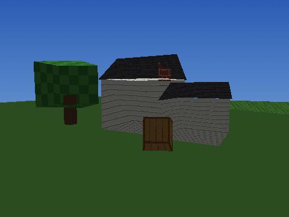

# engine3d — a retro software 3D renderer in pure Hemlock

A small **PlayStation/N64-era** 3D engine written entirely in Hemlock — no SDL,
no OpenGL, no external image libraries. It rasterizes textured, lit triangles
into a memory framebuffer and writes the result out as a `.png` you can open
anywhere.

The deliberately retro look comes from doing things the way 1996 hardware did:

- **Affine (non-perspective-correct) texture mapping** — textures swim and warp
  across large polygons. This is *the* signature PS1 wobble.
- **Per-vertex (Gouraud) lighting** baked to a single intensity per vertex.
- **Low internal resolution** with chunky, nearest-neighbour textures.
- **5-bit color depth + ordered (Bayer) dithering** as a full-screen pass,
  exactly like 15-bit console framebuffers.
- Optional **vertex jitter** for that twitchy, snapping geometry.



## Quick start

Run from the repository root (asset paths are relative to the working dir):

```bash
./hemlock examples/engine3d/gen_assets.hml   # generate textures + an OBJ (once)
./hemlock examples/engine3d/demo.hml         # render the house scene -> scene.png
./hemlock examples/engine3d/turntable.hml    # render an orbiting crate -> frames/
```

`gen_assets.hml` procedurally builds the `assets/` textures (`.ppm`) and a
`cube.obj`, so the demo exercises the real texture- and mesh-loading paths.

## Files

| File | Responsibility |
|------|----------------|
| `vec.hml`         | vec3 + 4x4 matrix math (perspective, look-at, transforms) |
| `framebuffer.hml` | color + depth buffers, clear / gradient sky / save PNG |
| `png.hml`         | pure-Hemlock PNG writer (stored DEFLATE + CRC32/Adler32) |
| `texture.hml`     | textures, nearest sampling, procedural gen, PPM load/save |
| `raster.hml`      | the triangle rasterizer (affine UV, z-buffer, Gouraud) |
| `engine.hml`      | the pipeline: transform → near-clip → project → shade |
| `mesh.hml`        | mesh container, Wavefront **OBJ loader**, primitive builders |
| `postfx.hml`      | color-depth reduction + ordered dithering |
| `gen_assets.hml`  | writes the demo's `.ppm` / `.obj` assets |
| `demo.hml`        | the suburban-house showcase scene |
| `turntable.hml`   | renders an orbiting model to a PNG sequence |

## How a frame is drawn

1. **Transform** each triangle by `MVP = projection · view · model` into clip space.
2. **Light** each vertex in world space: `ambient + diffuse · max(0, n·-L)`.
3. **Near-plane clip** (Sutherland–Hodgman against `w ≥ ε`) so polygons crossing
   the camera plane don't blow up during the perspective divide.
4. **Perspective divide + viewport** to screen pixels.
5. **Rasterize**: edge-function barycentric coverage, z-buffer depth test, and
   *affine* interpolation of U/V and light — the part that makes it look retro.
6. **Post-process**: ordered dither + quantize to 5-bit color.
7. **Save** the framebuffer as a PNG.

## Using your own models and textures

```hemlock
import { load_obj } from "./mesh.hml";
import { tex_load_ppm } from "./texture.hml";
import { render_mesh } from "./engine.hml";

let mesh = load_obj("path/to/model.obj");   // v / vt / vn, polygons fan-triangulated
let tex  = tex_load_ppm("path/to/skin.ppm"); // binary P6 PPM
render_mesh(fb, renderer, mesh, model_matrix, tex);
```

The OBJ loader handles `v`, `vt`, `vn`, and `f` with `p`, `p/t`, `p//n`, and
`p/t/n` vertex forms. Textures are binary PPM (P6); use `tex_save_ppm` to convert
procedural textures into reusable files.

## Tunable knobs

On the renderer object (`renderer_new(...)`):

- `cull` — `1` cull back faces, `-1` cull front faces, `0` draw both sides.
- `jitter` — vertex snap grid in pixels (`0` off); try `1.0`–`2.0` for PS1 wobble.
- `ambient`, `light_dir` — lighting.

In `apply_retro(fb, levels, dither)`:

- `levels` — shades per channel (`32` = 5-bit console color, `256` = off).
- `dither` — enable/disable ordered dithering.

## Limitations (by design — it's a teaching renderer)

- Software only and single-threaded; keep resolutions modest.
- Affine texture mapping on purpose — there is no perspective-correct path.
- No mipmaps/bilinear filtering, no alpha blending, near-plane clipping only.

Developed and verified against the `hemlock` interpreter. It relies only on
standard language features and stdlib modules (`@stdlib/math`, `@stdlib/hash`),
so it is intended to run under the `hemlockc` compiler as well.
